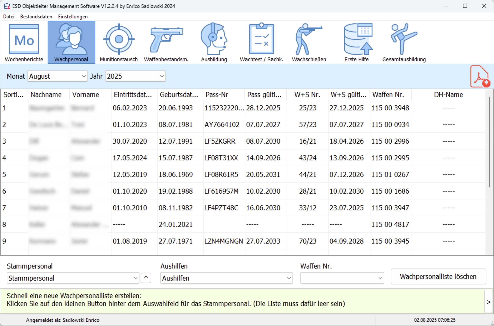
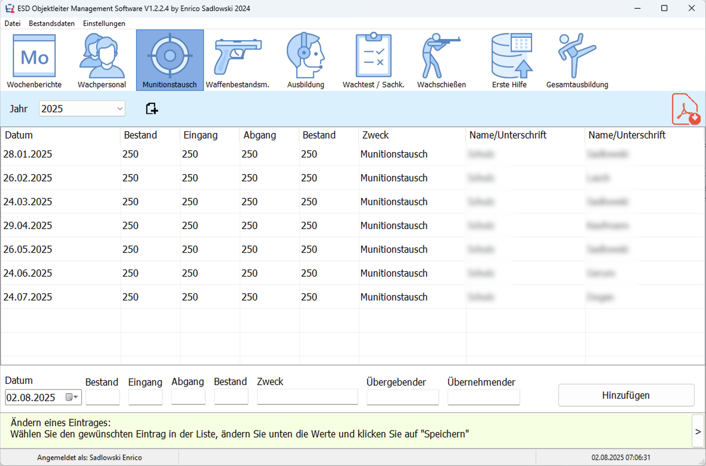
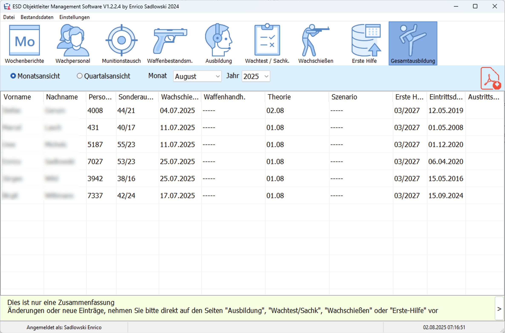
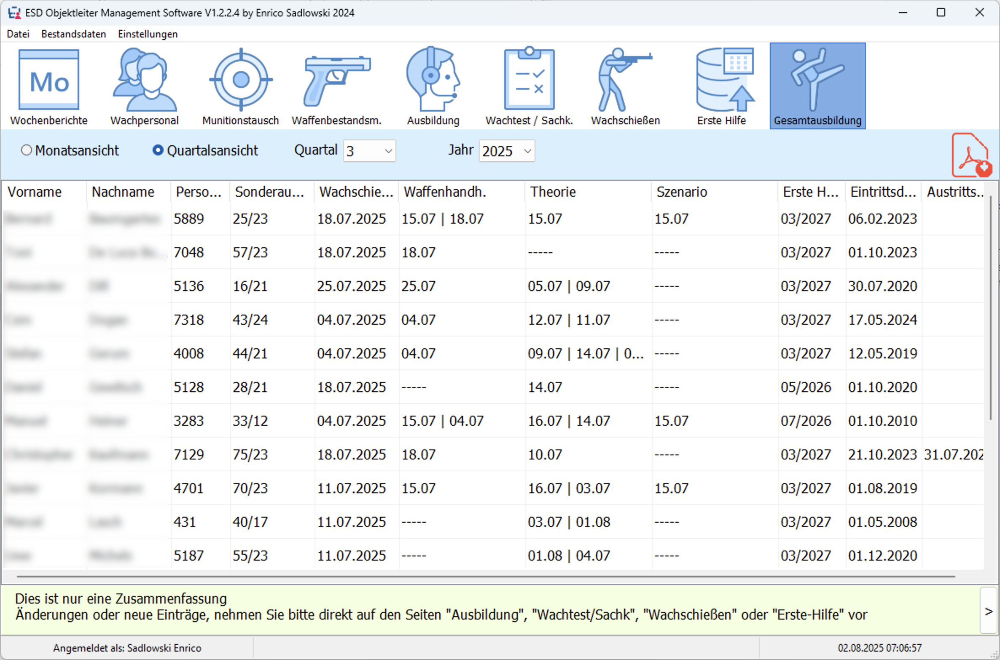

# Objektleiter Management System

## Funktion
Mit diesem Programm ist es möglich sämtliche Objekte, Waffen- und Munition, Diensthunde, das Stammpersonal, wie Aushilfspersonal zu verwalten.
Diese Daten können anschließend für die schnelle Erstellung von Wochenberichten, Waffenbestandsmeldungen, Wachpersonallisten, 
Ausbildungsunterlagen und Munitionstauschlisten genutzt werden.

Das Programm sorgt dafür dass auf jedem Dokument die aktuellsten Daten stehen, da nur an einer Stelle Daten angepasst werden müssen. 
Wenn z.B. ein Mitarbeiter einen neuen Personalausweis oder Sonder- und Waffenausweis bekommt, werden diese unter Bestandsdaten->Mitarbeiter angepasst.

## Merkmale

- Plattform: Windows
- Programmiert in: Delphi
- Datenbank: SQLite3
- Verschlüsselung: OpenSSL (libeay32.dll, ssleay32.dll)

## Stammdaten - Mitarbeiter
### Hier können neue Mitarbeiter angelegt oder vorhandene bearbeitet werden.

**Stammdaten - Mitarbeiter**

**Stammdaten - Mitarbeiter bearbeiten**

**Stammdaten - Mitarbeiter bearbeiten - Aushilfsobjekte**

## Stammdaten - Objekte
### Hier werden alle Objekte angegeben, aus denen Aushilfen angefordert werden können.

**Stammdaten - Objekte**

## Waffen- und Munition
### In dieser Liste werden sämtliche im Objekt genutzten Waffen und Munition angegeben.

**Einstellungen - Waffen- und Munition**

## Programmeinstellungen - Pfadangaben
### Hier kann für jede Art von Dokument angegeben werden, in welchem Verzeichnis diese gespeichert werden sollen.

**Programmeinstellunegn - Pfadangaben**

## Wochenberichte
### Hier können alle angelegten Wochenberichte bearbeitet und anschließend als PDG gespeichert werden.

**Wochenberichte**

## Wachpersonal
### Alle Mitarbeiter die im gewählten Monat eingesetzt waren, können hier eingetragen werden.

**Wachpersonal**

## Munitionstausch
### Hier wird der monatlichen Munitionstausch eingetragen. Es kann eine Jahres-Übersicht der Munitionstauschliste gespeichert werden.

**Munitionstausch**

## Waffenbestandsmeldungen
### Hier wird angegeben welcher Minarbeiter im gewählten Monat welche Waffe genutzt hat.

**Waffenbestandsmeldung**

## Ausbildung
### Auf dieser Seite werden sämtliche Ausbildungen eingetragen. 
### Diese können im Anschluss über die Seite "Gesamtausbildung" eingesehen und nach Quartal und Monat ausgedruckt werden.

**Ausbildung**

## Wachtest - Waffensachkunde
### Hier wird monatlich eingetragen wann der einzelne Mitarbeiter den Wachtest ausgefüllt hat.
### Es kann eine Jahresübersicht ausgedruckt werden.

**Wachtest / Waffensachkunde**

## Wachschießen
### Auf dieser Seite wird eingetragen welcher Mitarbeiter wann an der Schießausbildung teilgenommen hat.
### Es kann eine Jahresübersicht ausgedruckt werden.
### Außerdem kann eine Quartalsübersicht und zusätzlich ein Formular zur Beantragung der Tankgutscheine ausgedruckt werden. 

**Wachschiessen**

## Erste Hilfe
### Hier wird eingetragen wann der einzelne Mitarbeiter an der Erste-Hilfe Ausbildung teilgenommen hat.
### Man kann direkt sehen, wenn die Gültigkeit abläuft.

**Erste Hilfe**

## Gesamtausbildung - Monatsansicht
### Hier werden alle Ausbildungen die im gewählten Monat durchgeführt wurden, ausgegeben.

**Gesamtausbildung - Monatsansicht**

## Gesamtausbildung - Quartalsansicht
### Hier werden alle Ausbildungen die im gewählten Quartal durchgeführt wurden, ausgegeben.

**Gesamtausbildung - Quartalsansicht**
